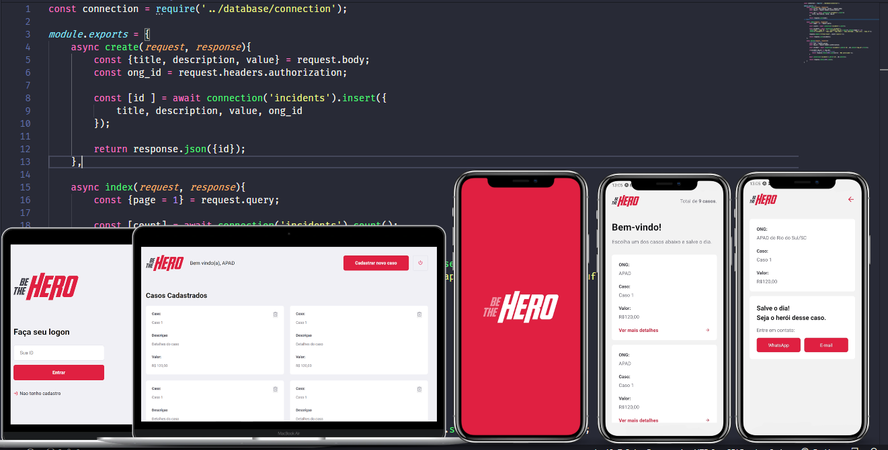
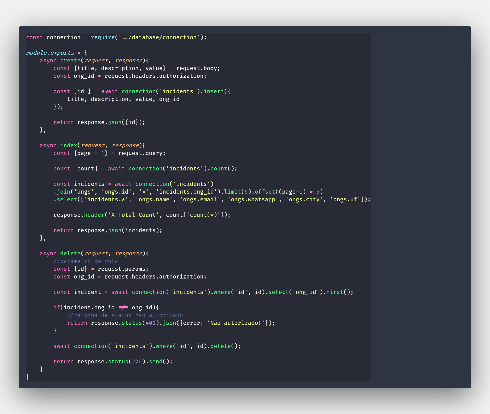
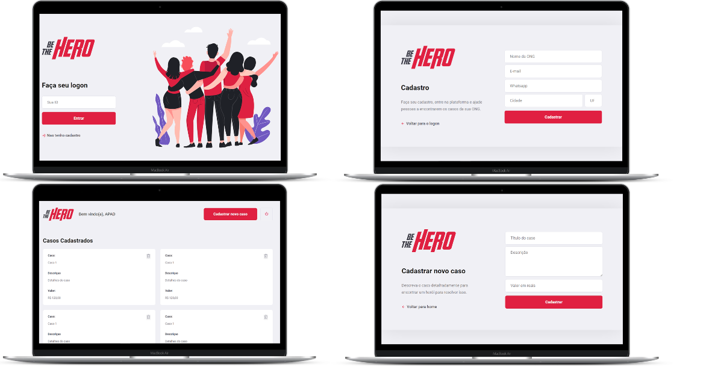
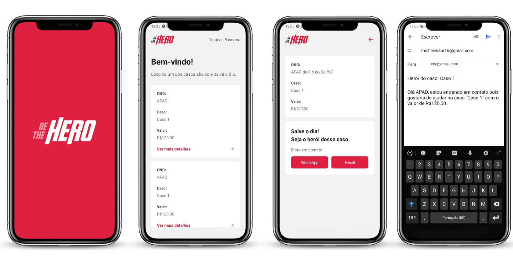

# Sobre

Este projeto é o resultado do aprendizado obtido na semana Omnistack 11
Que possue o objetivo de introduzir o desenvolvedor nas stack javaScript em alta no mercado, Node.js, React JS e React Native.

O Be The Hero é um sistema para que ONGS cadastrem os casos( ajudas/doações que precisam )na plataforma WEB e o usuário veja no app mobile as ONGS que estão precisando de ajuda e entrem em contato no Whatsapp ou email pelo mesmo app.

Esse produto é produzido em três partes:
  1. Back-end - Desenvolvido em Node.js.
  2. Front-end Web - Desenvolvido em React JS.
  3. Front-end Mobile - Desenvolvido em React Native.

## Back-End  Node.js
A estrutura lógica do projeto foi implementado com a tecnologia Node.js, mais as bibliotecas suplementares externas:
  1. Express.
  2. Knex.
  3. Axios.
  4. Nodemon.
  5. Cors
  6.sqlite3  
Foi posto em prática algumas técnicas atuais para desenvolvimento, por exemplo, Arrow Function, Controller, Model, reutilização de código como componente, Rotas e recursos, Métodos HTTP, Tipos de Parametros, Relacionamentos de tabelas.

O resultado dessa parte é uma API com rotas, que permite a busca, cadastro, listagem e exclusão de ONGS e seus casos.

## Front-End Web ReactJS
`"O React é uma biblioteca JavaScript de código aberto com foco em criar interfaces de usuário em páginas web. É mantido pelo Facebook, Instagram, outras empresas e uma comunidade de desenvolvedores individuais. É utilizado nos sites da Netflix, Imgur, Feedly, Airbnb, SeatGeek, HelloSign, Walmart e outros."` - Wikipédia

Essa aplicaçáo web foi construida através de um script, próprio do React, com o propósito de deixar o sistema pronto para uso, automaticamente são instaladas bibliotecas, mas especificamente nesse projeto, tive que usar o Axios para consumir os dados da API que criei no módulo back-end.

Dependencias utilizadas:
  1. React Icons
  2. React Router Dom
  3. Axios

 
Na aplicação web temos as telas de:
  1. Login,
  2. Cadastro de ONG
  3. Home - Listagem de casos da ONG
  4. Cadastro de um novo caso da ONG
  5. (Funcionalidade) - Logout

## Front-End Mobile React Native
`"React Native é uma biblioteca Javascript criada pelo Facebook. É usada para desenvolver aplicativos para os sistemas Android e IOS de forma nativa"`- Wikipédia

O aplicativo consiste é uma lista que mostra ONGS que precisam de ajuda com algum caso, ao ver mais detalhes o usuário pode entrar em contato no Whatsapp ou email pelo próprio app. Esse sistema foi desenvolvido com auxilio de bibliotecas atuais e bastantes usadas no mercado.
    1. React Navigation
    2. Expo Constants
    3. Expo Mail Composer
    4. Axios
    5. Intl

<strong>Contato</strong>

michelvictor16@gmail.com
